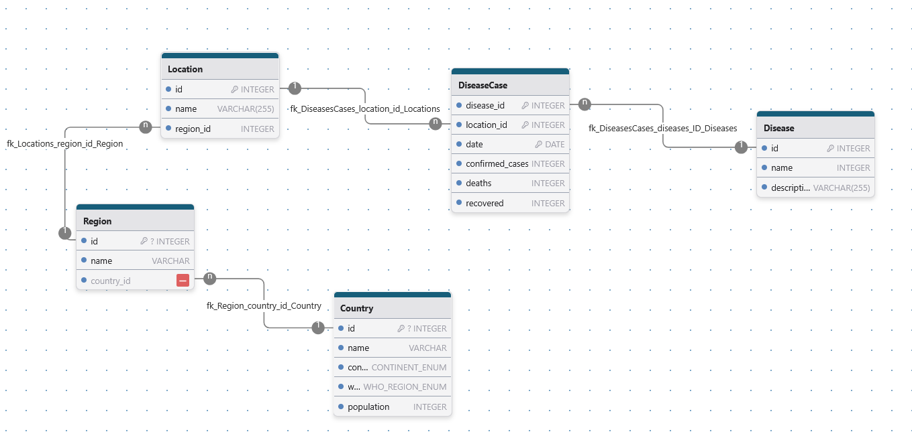

# Modèle de Données

## Diagramme du Modèle de Données

## Entités

### Disease (Maladie)

Représente une maladie suivie par l'OMS.

| Champ       | Type         | Description                      |
| ----------- | ------------ | -------------------------------- |
| id          | INTEGER      | Identifiant unique de la maladie |
| name        | VARCHAR(255) | Nom de la maladie                |
| description | VARCHAR(255) | Description de la maladie        |

### Location (Localisation)

Représente une zone géographique spécifique.

| Champ     | Type         | Description                           |
| --------- | ------------ | ------------------------------------- |
| id        | INTEGER      | Identifiant unique de la localisation |
| name      | VARCHAR(255) | Nom de la localisation                |
| region_id | INTEGER      | Clé étrangère vers la région          |

### Region

Représente une région administrative.

| Champ      | Type    | Description                     |
| ---------- | ------- | ------------------------------- |
| id         | INTEGER | Identifiant unique de la région |
| name       | VARCHAR | Nom de la région                |
| country_id | INTEGER | Clé étrangère vers le pays      |

### Country (Pays)

Représente un pays avec ses informations démographiques.

| Champ      | Type            | Description                |
| ---------- | --------------- | -------------------------- |
| id         | INTEGER         | Identifiant unique du pays |
| name       | VARCHAR         | Nom du pays                |
| continent  | CONTINENT_ENUM  | Continent du pays          |
| who_region | WHO_REGION_ENUM | Région OMS                 |
| population | INTEGER         | Population du pays         |

### DiseaseCase (Cas de Maladie)

Représente les statistiques de cas pour une maladie dans une localisation donnée.

| Champ           | Type    | Description                        |
| --------------- | ------- | ---------------------------------- |
| disease_id      | INTEGER | Clé étrangère vers la maladie      |
| location_id     | INTEGER | Clé étrangère vers la localisation |
| date            | DATE    | Date des statistiques              |
| confirmed_cases | INTEGER | Nombre de cas confirmés            |
| deaths          | INTEGER | Nombre de décès                    |
| recovered       | INTEGER | Nombre de personnes guéries        |

## Relations

1. **Location - Region** (N:1)

   - Une location appartient à une seule région
   - Une région peut avoir plusieurs locations

2. **Region - Country** (N:1)

   - Une région appartient à un seul pays
   - Un pays peut avoir plusieurs régions

3. **DiseaseCase - Disease** (N:1)

   - Un cas est lié à une seule maladie
   - Une maladie peut avoir plusieurs cas

4. **DiseaseCase - Location** (N:1)
   - Un cas est lié à une seule location
   - Une location peut avoir plusieurs cas

## Énumérations

### CONTINENT_ENUM

- Valeurs possibles pour les continents

### WHO_REGION_ENUM

- Valeurs possibles pour les régions définies par l'OMS

## Notes Techniques

- Toutes les clés primaires sont auto-incrémentées
- Les relations sont maintenues par des clés étrangères avec contraintes d'intégrité référentielle
- Les dates sont stockées au format ISO 8601
- Les compteurs (confirmed_cases, deaths, recovered) ne peuvent pas être négatifs
