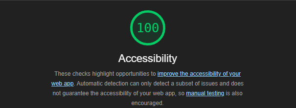

# Documentation d'Accessibilité Frontend

## Aperçu

Ce document décrit les fonctionnalités d'accessibilité et les normes mises en œuvre dans notre application frontend pour assurer la conformité aux WCAG (Web Content Accessibility Guidelines) et fournir une expérience utilisateur inclusive pour tous les utilisateurs, y compris ceux en situation de handicap.

## Fonctionnalités d'Accessibilité Implémentées

### 1. Rôles et Labels ARIA

L'application implémente des rôles et labels ARIA (Applications Internet Riches Accessibles) appropriés dans tous ses composants :

- **Tableau de Bord Principal**

  - Zone de contenu principal marquée avec `role="main"`
  - Hiérarchie appropriée des titres avec sections étiquetées
  - Zone de filtres marquée avec `role="region"`
  - Section des indicateurs KPI marquée avec les labels ARIA appropriés

- **Tableaux de Données**

  - Structure de tableau avec rôles ARIA appropriés
  - Colonnes triables avec attributs `aria-sort`
  - En-têtes de lignes et colonnes correctement étiquetés
  - États de chargement annoncés via les régions `aria-live`

- **Formulaires et Champs de Saisie**
  - Tous les contrôles de formulaire ont des labels associés
  - Messages d'erreur liés aux champs via `aria-describedby`
  - Champs obligatoires marqués avec des indicateurs visuels et ARIA
  - Retour de validation de formulaire fourni via les régions ARIA live

### 2. Navigation au Clavier

- Tous les éléments interactifs sont accessibles au clavier
- Ordre de tabulation logique maintenu dans toute l'application
- Indicateurs de focus visibles et clairement stylés
- Pas de pièges au clavier dans les boîtes de dialogue modales ou les widgets complexes

### 3. Support des Lecteurs d'Écran

- Textes alternatifs significatifs pour les images et icônes
- Mises à jour d'état annoncées via les régions `aria-live`
- Texte d'aide caché pour les lecteurs d'écran où nécessaire
- Structure claire des titres pour une navigation facile

### 4. Considérations Visuelles

- Schémas de couleurs à fort contraste
- Texte respectant les exigences minimales de contraste
- Éléments interactifs clairement visibles
- Design responsive maintenant l'accessibilité à toutes les tailles d'écran

### 5. Accessibilité des Formulaires

- Messages d'erreur clairs
- Retour de validation de formulaire
- Indication des champs obligatoires
- Instructions de saisie claires
- Associations appropriées des labels

## Implémentation Spécifique aux Composants

### Composant Tableau de Bord

```typescript
// Fonctionnalités d'accessibilité clés :
- Rôle de région principale
- Sections étiquetées
- Régions ARIA live pour le contenu dynamique
- Hiérarchie appropriée des titres
```

### Composant Tableaux de Données

```typescript
// Fonctionnalités d'accessibilité clés :
- En-têtes de colonnes triables avec attributs ARIA
- Relations lignes/colonnes
- Annonces pour le tri et le filtrage via lecteur d'écran
```

### Composants de Dialogue

```typescript
// Fonctionnalités d'accessibilité clés :
- Rôle modal
- Gestion du focus
- Gestion de la touche Échap
- Labels ARIA pour les contrôles de formulaire
```

## Tests et Validation

### Tests Automatisés

#### Résultats Lighthouse



Notre application a obtenu un score parfait de 100/100 en accessibilité selon l'audit Lighthouse, démontrant notre engagement envers les meilleures pratiques d'accessibilité web. Ce score reflète :

- La conformité aux directives WCAG
- L'implémentation correcte des attributs ARIA
- La structure sémantique appropriée
- Le contraste des couleurs adéquat
- La navigation au clavier fonctionnelle

> **Note** : Bien que le score Lighthouse soit excellent, nous continuons à effectuer des tests manuels réguliers pour garantir une expérience utilisateur optimale pour tous.

- Audits réguliers avec Lighthouse

### Tests Manuels

- Tests de navigation au clavier
- Tests avec lecteur d'écran
- Tests en mode contraste élevé
- Tests de compatibilité navigateur

## Bonnes Pratiques pour les Développeurs

1. **Toujours Inclure des Labels ARIA**

   ```html
   <button aria-label="Fermer la boîte de dialogue">
     <mat-icon>close</mat-icon>
   </button>
   ```

2. **Structure Appropriée des Titres**

   ```html
   <h1>Titre Principal de la Page</h1>
   <section>
     <h2>Titre de Section</h2>
     <!-- Contenu -->
   </section>
   ```

3. **Labels des Champs de Formulaire**
   ```html
   <mat-form-field>
     <mat-label>Rechercher des pays</mat-label>
     <input matInput [attr.aria-label]="'Rechercher des pays'" />
   </mat-form-field>
   ```

## Normes de Conformité

L'application vise à respecter les normes WCAG 2.1 Niveau AA, notamment :

- Perceptible : L'information doit être présentable aux utilisateurs de manière perceptible
- Utilisable : Les composants de l'interface utilisateur doivent être utilisables
- Compréhensible : L'information et l'utilisation doivent être compréhensibles
- Robuste : Le contenu doit être suffisamment robuste pour être interprété par une grande variété d'agents utilisateurs

## Améliorations Futures

1. Implémenter des liens d'évitement pour le contenu principal
2. Raccourcis clavier améliorés pour les utilisateurs avancés
3. Amélioration de la gestion du focus dans les interactions complexes
4. Régions ARIA live supplémentaires pour les mises à jour de contenu dynamique

## Ressources

- [Directives WCAG 2.1](https://www.w3.org/WAI/WCAG21/quickref/)
- [Guide d'Accessibilité Angular](https://angular.io/guide/accessibility)
- [Accessibilité Material Design](https://material.angular.io/cdk/a11y/overview)
